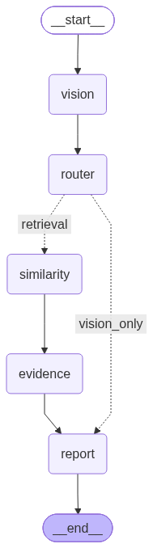

## Confidence-aware Multi-Agent Fabric Inspection System

Features:

DINOv2-based defect recognition
Agentic orchestration with LangGraph
Similar defect retrieval using ANNOY approximate nearest neighbor search
Manufacturing context reasoning
Confidence-aware decision making

### 1. Data

Chosen model was trained and evaluated on the [Fabric Defect Dataset](https://www.kaggle.com/datasets/raiyansayeed/fabric-defect-dataset), available on Kaggle.

The dataset contains **3,067 images across 9 classes**:

* Broken stitch
* Needle mark
* Pinched fabric
* Vertical
* Defect free
* Hole
* Horizontal
* Lines
* Stain

Sqlite database contains Unique Image ID (Primary key), image_path - path to the image, defect_class - defect type, severity - severity of defect (text), description - defect
description.
Original dataset doesn't contain defect descriptions, this database was filled with generated data. For this I used Qwen2_5 model. For each given image we interogated VLM model with 
prompt: """
                The ground-truth defect category is "{class_name}".
                Do NOT classify the defect again.
                Instead, analyze only the visual appearance.
                Return ONLY valid JSON.
                {{
                    "defect_type": "{class_name}",
                    "severity": "low | medium | high",
                    "description": ""
                }}
          """
The scripts with model training and choosing can be found in [fabric models repository](https://github.com/tyemelya/Fabric_inspection_models).

### 2. Project structure

fabric-inspection-agents/

```text
├── app/
|
|   ├── api/
|   |   ├── routes.py
|   |   └── schemas.py
|.  |
|.  |
|   ├── ml/
|   |   ├── data.py
|   |   ├── inference_model.py
|   |   ├── loader.py
|   |   └── models.py
|.  |
|.  |
|   ├── tools/
|   |   ├── evidence.py
|   |   ├── LLMTool.py
|   |   ├── metadata.py
|   |   ├── similarity.py
|   |   └── vision.py 
│   |
|.  |
|   ├── graph.py
│   ├── inspection.py
│   ├── main.py
│   └──  state.py
|
|  
│   ├── models/
│   │   └── best_lora_dino.pt
│   │
│   └── api.py
│
│
├── data/
│
│   ├── fabric_dataset/
│   ├── annoy_index_info.json
|   ├── class_names.json
|   ├── fabric.ann
│   └── fabric.db
│
│
├── frontend/
│
│   └── streamlit_app.py
│
│
├── scripts/
│
│   ├── build_annoy_index.py
│   └── generate_metadata.py 
│
│
├── tests/
│
|   ├── test_api.py
|   ├── test_evidence_tool.py
|   ├── test_inspection_graph.py
|   ├── test_llmtool.py
|   ├── test_metadata_tool.py
|   ├── test_similarity_tool.py
|.  └── test_visiontool
|   
│
├── docker-compose.yml
│
├── requirements.txt
│
└── README.md
```

### 3. LangGraph Design
LangGraph includes two agents: router and report and uses 5 tools: vision, similarity, evidence, metadata, and LLMTool.




