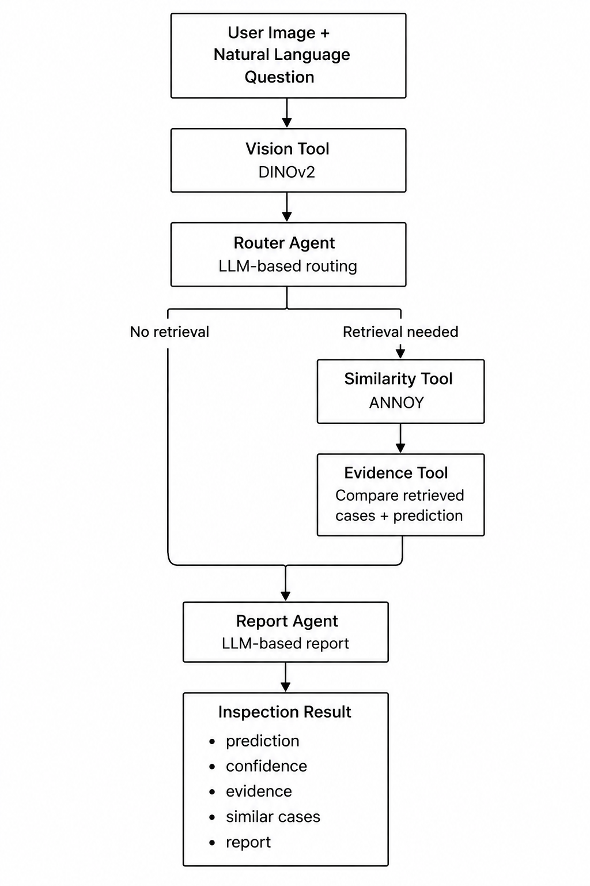

## Confidence-Aware Agentic Fabric Inspection System

An AI-powered fabric inspection system that combines vision-based defect recognition, agentic workflow orchestration, visual similarity retrieval, and evidence-based reasoning.

The system takes a fabric image and a natural-language question as input and produces an inspection report containing:

- Predicted defect class
- Vision model confidence
- Similar historical fabric cases when relevant
- Evidence agreement between retrieved cases and the prediction
- A natural-language inspection report

### Key Features
- DINOv2-based defect recognition – identifies fabric defects using a fine-tuned vision model.
- Agentic orchestration with LangGraph – dynamically determines whether the inspection requires only vision analysis or additional retrieval and evidence.
- Visual similarity search with ANNOY – retrieves visually similar historical fabric samples using DINOv2 embeddings.
- Manufacturing context – historical cases contain defect type, severity, and textual descriptions.
- Confidence-aware reasoning – combines vision confidence with retrieved evidence to provide a more informative inspection result.
- FastAPI backend – exposes the inspection pipeline through a REST API.
- Streamlit frontend – provides an interactive interface for image inspection and visualization of similar cases.
- Automated testing – includes unit tests for tools, graph routing, and API endpoints.

## Demo

[▶️ Watch the demo](./images/fabric_inspection_dem.mp4)


### 1. Data

The chosen vision model was trained and evaluated on the [Fabric Defect Dataset](https://www.kaggle.com/datasets/raiyansayeed/fabric-defect-dataset) available on Kaggle.
The dataset contains **3,067 images across 9 classes**:
- Broken stitch
- Needle mark
- Pinched fabric
- Vertical
- Defect free
- Hole
- Horizontal
- Lines
- Stain

The original dataset provides defect labels but does not contain manufacturing-oriented descriptions or severity annotations. To enrich the dataset with contextual information for the retrieval and evidence stages, an additional SQLite database was created.

Metadata is stored in an SQLite database (`fabric.db`). The schema of the `fabric_defects` table is:

```text
fabric_defects
├── id
├── image_path
├── defect_class
├── severity
└── description
```

The defect_class field is the original ground-truth label. Severity and description were generated using Qwen2.5-VL. The ground-truth class was explicitly provided to the model, instructing it not to perform classification, but only to describe the visual characteristics and estimate severity.

<details>
<summary>Metadata generation prompt</summary>

```text
The ground-truth defect category is "{class_name}".

Do NOT classify the defect again.
Instead, analyze only the visual appearance.

Return ONLY valid JSON.

{
    "defect_type": "{class_name}",
    "severity": "low | medium | high",
    "description": ""
}
```
</details>


The scripts with model training and choosing can be found in [fabric models repository](https://github.com/tyemelya/Fabric_inspection_models).

### 2. Architecture

The workflow always starts with visual analysis. The Router Agent then determines whether the user's question requires historical retrieval. Retrieval and evidence evaluation are performed only when needed.



                    
### 3. Project structure

```text
fabric-inspection-agents/
│
├── app/
│   ├── api/                 # FastAPI routes and schemas
│   ├── ml/                  # Model loading and inference
│   ├── tools/               # Vision, retrieval, evidence and LLM tools
│   ├── graph.py             # LangGraph workflow
│   ├── inspection.py        # Inspection service
│   ├── state.py             # Graph state
│   └── main.py              # FastAPI application
│
├── frontend/
│   └── streamlit_app.py     # Streamlit interface
│
├── scripts/
│   ├── build_annoy_index.py
│   └── generate_metadata.py
│
├── tests/                   # Unit and API tests
│
├── data/                    # Local datasets and generated artifacts
├── models/                  # Trained model weights
│
├── docker-compose.yml
├── requirements.txt
└── README.md
```

### 4. LangGraph Design

The LangGraph workflow contains two LLM-driven agents:

- **Router Agent** — interprets the user's question and decides whether retrieval is required.
- **Report Agent** — generates the final inspection report using the available vision results and, when applicable, retrieved evidence.

The agents interact with specialized tools:

- **VisionTool** — defect classification and DINOv2 embedding extraction.
- **SimilarityTool** — nearest-neighbor search over historical embeddings using ANNOY.
- **EvidenceTool** — evaluates agreement between the predicted defect and retrieved cases.
- **MetadataTool** — retrieves historical case metadata from SQLite.
- **LLMTool** — provides LLM inference for routing and report generation.


### 5. Inspection Flow
1. Image analysis
DINOv2 analyzes the uploaded fabric image and produces a defect prediction, confidence score, and normalized embedding.
2. Question interpretation
The Router Agent analyzes the user's question and determines whether historical examples or additional evidence are required.
3. Similarity retrieval
If retrieval is required, the image embedding is compared against the ANNOY index to retrieve visually similar historical cases.
4. Evidence evaluation
The Evidence Tool compares the retrieved defect classes with the vision prediction and calculates an evidence score.
5. Report generation
The Report Agent combines the vision result, retrieval evidence, and user question to produce the final inspection report.
6. Result presentation
The API returns structured inspection results, while the Streamlit frontend displays the prediction, confidence, report, and similar fabric images.

### 6. Confidence-Aware Decision Making
The system does not rely exclusively on the vision model prediction.

When retrieval is requested, the system compares the predicted defect with visually similar historical cases. The two signals represent different aspects of the decision:

- **Vision confidence** reflects the model's confidence in its visual classification.
- **Evidence score** reflects how strongly the retrieved historical cases support that prediction.
  
For example:

```text
Vision prediction
    Broken stitch
    Confidence: 94%

        +

Retrieved cases
    Broken stitch
    Broken stitch
    Broken stitch
    Hole
    Broken stitch

        ↓

Evidence score
    0.87

        ↓

Final report
    High confidence
    Historical cases largely support the prediction

```

### 7. API/frontend

### API

| Method | Endpoint | Description |
|---|---|---|
| `POST` | `/inspect` | Inspect an uploaded fabric image |
| `GET` | `/images/{image_id}` | Retrieve a historical fabric image |
| `GET` | `/health` | API health check |

API separates the inspection backend from the UI.

Frontend

A Streamlit frontend provides an interactive interface for uploading a fabric image, entering a natural-language question, viewing the predicted defect and confidence, and displaying retrieved historical cases alongside their metadata.

### 8. Testing
The project includes unit and integration tests covering the main components of the inspection pipeline:
- Metadata retrieval
- Similarity search
- Vision inference
- LLM routing and JSON parsing
- Evidence calculation
- LangGraph routing
- FastAPI endpoints

Graph tests use mocked tools, allowing workflow behaviour to be tested without loading the large vision/LLM models.

### 9. Why these technologies?

| Component     | Technology    | Reason                                                             |
| ------------- | ------------- | ------------------------------------------------------------------ |
| Vision        | DINOv2 + LoRA | Strong visual representations with parameter-efficient fine-tuning |
| Orchestration | LangGraph     | Explicit stateful workflow and conditional routing                 |
| Retrieval     | ANNOY         | Efficient approximate nearest-neighbor search                      |
| Metadata      | SQLite        | Lightweight relational storage for historical cases                |
| LLM           | Qwen2.5       | Local LLM inference for routing and report generation              |
| Backend       | FastAPI       | Typed REST API and automatic OpenAPI documentation                 |
| Frontend      | Streamlit     | Lightweight interactive inspection interface                       |
| Testing       | Pytest        | Unit and integration testing                                       |


